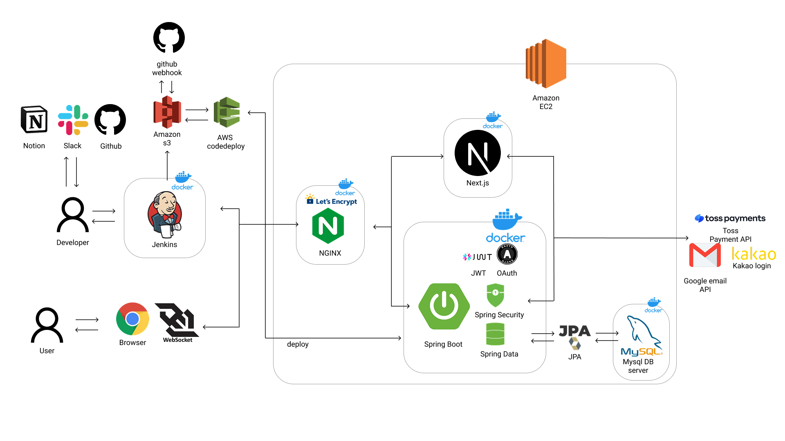
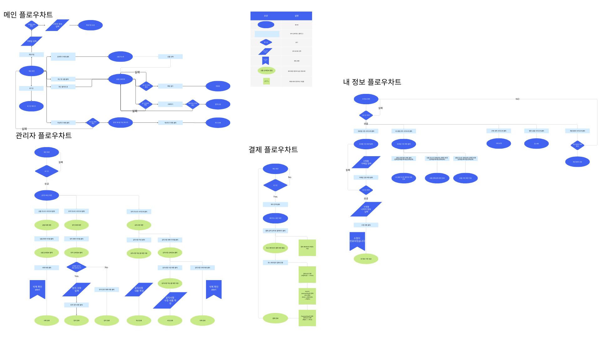
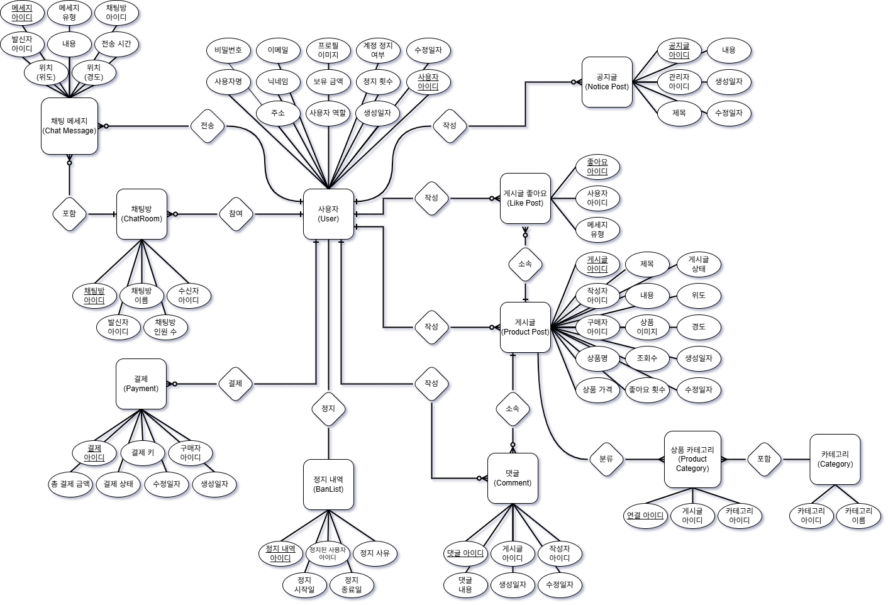
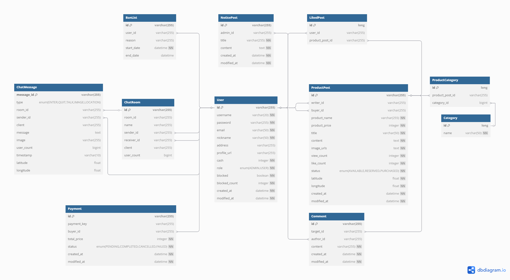

# 팀 프로젝트

프로그래머스 4기 5회차 3차 팀프로젝트 5팀입니다

---

## 📌 프로젝트 개요

**중고 거래 플랫폼**을 주제로 한 웹 서비스입니다.

- **2차 프로젝트**에서 개발한 시스템을 기반으로,
- **3차 프로젝트**에서는 **Kotlin 기반으로 마이그레이션**하고
- **SSE 기반 실시간 알림**, **위치 기반 게시물 탐색**, **검색 필터 고도화** 등 다양한 기능을 확장하였습니다.

### ✨ 추가된 주요 기능

- 실시간 알림 (Kafka + SSE)
- 1:1 채팅 기능 강화
- 위치 및 거리 기반 상품 탐색
- 메인 관리자 추가
- 상품 게시글 지도 추가
- 상품 검색 필터

---

## 🧑‍🤝‍🧑 팀원 및 역할

* 3차 프로젝트 추가 담당 내용입니다.

| 이름  | GitHub                                         | 담당 역할 (FE)        | 담당 역할 (BE)    |
|-----|------------------------------------------------|-------------------|---------------|
| 김지우 | [@omegafrog](https://github.com/omegafrog)     | 댓글 및 구매 버그 개선     | SSE 알림, 성능 개선 |
| 김아성 | [@asungkim](https://github.com/asungkim)       | 상품 상세 게시글 UI 개선   | 상품 검색 필터 추가   |
| 옥정현 | [@okjunghyeon](https://github.com/okjunghyeon) | 최근 본 상품 무한 스크롤 구현 | 관리자 CRUD 구현   |
| 서준식 | [@sojunsik](https://github.com/sojunsik)       | 상품 관련 지도 추가       | 권한 관련 코드 추가   |
| 윤원석 | [@wonseokyoon](https://github.com/wonseokyoon) | 위치 기준 상품 조회       | 채팅 기능 강화      |

---

## 🛠 기술 스택

### 📕 Language


### 🖥 Frontend


### 🛠 Backend


### 🗄 DB / Cache


### 🔄 Message Queue / Real-time


### ☁️ DevOps / Infra


### 🤝 Collaboration


---

## 🔧 시스템 설계
<details>
<summary>시스템 구성도</summary>



</details>

<details>
<summary>플로우 차트</summary>



</details>

---

## 🧩 데이터 설계

<details>
<summary>ERD</summary>



</details>

<details>
<summary>테이블 구조</summary>



</details>

---
## 🛠️ 실행 방법

<details>
<summary> 프로그램 실행 </summary>

1. **깃 레포지토리 클론**

2. **프론트엔드 설정**
    - npm 기본파일 설치
    ```bash
    cd frontend
    npm install
    ```

    - frontend 폴더에 .env.local 파일 생성 
    ```bash
    NEXT_PUBLIC_BACKEND_HOST=localhost
    NEXT_PUBLIC_BACKEND_PORT=8080

    NEXT_PUBLIC_FRONTEND_HOST=localhost
    NEXT_PUBLIC_FRONTEND_PORT=3000
    NEXT_PUBLIC_PROTOCOL=http
    ```

3. **백엔드 환경 변수 및 프로필 설정**
    - IntelliJ 기준: Run/Debug Configurations에서
        - **Active profiles**: `dev, secret`
        - **Environment variables**는 아래와 같이 설정 (예시이며 본인 키로 대체 필요):
        ```bash
        AWS_ACCESS_KEY=AKIAR6T3IadTKIDEKNMF4HS;
        AWS_S3_BUCKET_NAME=nokdkae;
        AWS_SECRET_KEY=GqcCjsvokAradsFanrasdM7vhdTYkJyE3vhDaReMdUlP3+;
        JWT_SECRET=abcdefghijklmnopqrstuvwxyzaasd1234567890abcdefghijklmnopqrstuvwxyz1234567890;
        KAKAO_CLIENT_ID=f2f7512ce923ddasd4e37181ceb038246783;
        MAIL_PASSWORD=ldsc vkxp wjjd sqnl;
        TOSS_SECRET=dGVzdF9za180eUtlcTViZ3JwMndsadE2QmtNMGxtcDNHWDBselc2Og==;
        SERVER_HOST=localhost;
        FRONT_HOST=localhost;
        FRONT_PORT=3000
        ```

4. **Redis 및 Kafka 설치 및 실행**
    - 기본적으로 Docker가 설치되어 있어야 합니다.

    - Redis
    ```bash
    docker run -d --name redis -p 6379:6379 redis
    ```

    - Kafka
    ```bash
    cd backend/docker/kafka
    docker compose up -d
    ```

5. **백엔드 및 프론트엔드 실행**
    - IntelliJ에서 백엔드 실행
    - 프론트엔드에서 아래 명령어로 실행
    ```bash
    npm run dev
    ```

</details>

## 📏 팀 규칙

<details>
<summary>👥 협업 방식</summary>

- PR과 리뷰를 통한 코드 품질 유지
- GitHub Projects의 Kanban Board를 활용한 이슈 및 작업 관리

</details>

<details>
<summary>💬 커밋 메시지 컨벤션</summary>

- 커밋 메시지 형태: `<type>: 제목`
- 메시지는 한글로 작성

```bash
# 예시
git commit -m "feat: 주문 추가 기능 구현"
```

| Type     | 설명                  |
|----------|---------------------|
| feat     | 새로운 기능 추가           |
| fix      | 버그 수정               |
| docs     | 문서 수정               |
| refactor | 코드 리팩토링 (기능 변화 없음)  |
| style    | 스타일 변경 (공백, 세미콜론 등) |
| chore    | 기타 변경 (빌드, 설정 등)    |
| test     | 테스트 코드 추가 또는 수정     |
| merge    | 충돌 해결               |

</details>

<details>
<summary>📄 PR 작성 템플릿</summary>

```md
## 개요

<!-- 변경 사항과 이슈에 대해 간단히 작성해주세요 -->

## PR 유형

- [ ] 새로운 기능 추가
- [ ] 버그 수정
- [ ] 리팩토링
- [ ] 문서 수정
- [ ] 테스트 추가 / 리팩토링
- [ ] 기타

## PR Checklist

- [ ] 커밋 메시지 컨벤션을 지켰나요?
- [ ] 테스트는 모두 통과하였나요?
```

</details>


<details>
<summary>🌿 브랜치 및 이슈 작성 규칙</summary>

- 전략: **GitHub Flow**
- 브랜치 명: `이름/feat-issue번호`

#### ✅ 이슈 템플릿 예시

```md
[BE] feat: 주문 등록 API 구현

Given 사용자가 주문 등록 화면에 진입하고  
When 주문 내용을 입력 후 등록 버튼을 클릭하면  
Then 주문이 정상적으로 저장된다.
```

</details>

<details>
<summary>📐 네이밍 & 컨벤션</summary>

#### 📍 클래스

- PascalCase 사용

```java
public class UserAccount {
}
```

#### 📍 변수 & 메서드

- camelCase 사용

```kotlin
val userName: String
fun processOrder() {}
```

#### 📍 축약어도 camelCase

```kotlin
val httpClient  // ✅
val dto         // ✅
```

#### 📍 상수

- UPPER_SNAKE_CASE 사용

```kotlin
const val MAX_USER_COUNT = 100
```

#### 📍 패키지명

- 전부 소문자

```kotlin
com.example.service
```

#### 📍 줄임말 사용 금지 (논의된 경우 제외)

```kotlin
val message // ✅
val error   // ✅
```

</details>

<details>
<summary>📚 CRUD 명명</summary>

| 기능        | Controller       | Service          | Repository (JPA) |
|-----------|------------------|------------------|------------------|
| Create    | createUser()     | createUser()     | save()           |
| Read (단건) | getUserById()    | getUserById()    | findById()       |
| Read (목록) | getUserList()    | getUserList()    | findAll()        |
| Update    | updateUser()     | updateUser()     | save()           |
| Delete    | deleteUserById() | deleteUserById() | deleteById()     |

</details>

<details>
<summary>🌐 REST API URL 컨벤션</summary>

- 리소스는 **항상 복수형**
- 동사 대신 HTTP Method 사용
- 액션이 필요한 경우는 동사 포함

```http
# 일반적인 경우
GET    /api/v1/users
POST   /api/v1/orders

# 액션이 필요한 경우
POST   /api/v1/auth/login
POST   /api/v1/orders/{id}/approve
POST   /api/v1/users/{id}/ban
```

</details>
